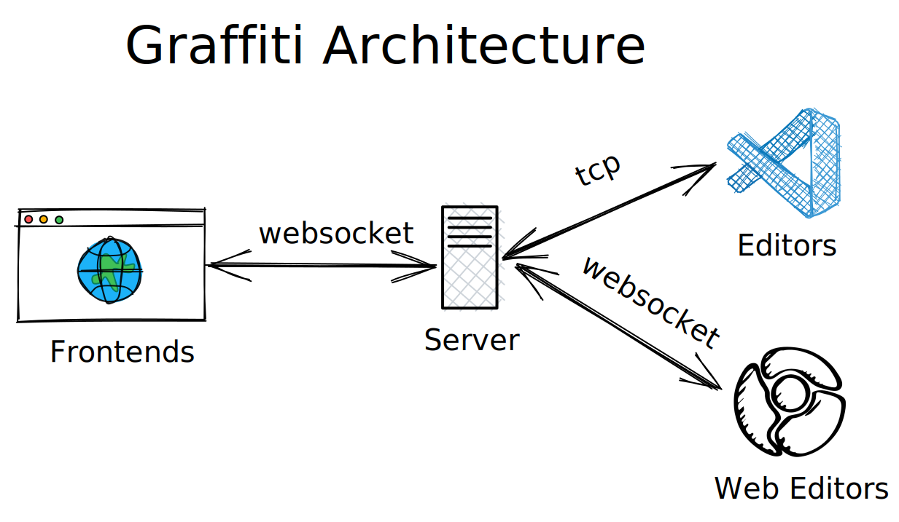

Graffiti
========
Create customized callgraph directly from your favorite editor.


## Features
* Add a node to the callgraph directly from your editor. 
* You choose what to add and where.
* Open the selected node in the editor using right click.
* Export the graph to mermaid 
* The graph support scrolling and zooming
* Auto save to localstorage, can export to file.
* Multiple tabs
* Rename in the editor? the change will propagate to the graph.

## Architecture

Graffiti was built with the following assumptions:
- You might use more than a single editor for a project.
- You might want to run everything locally.
- It should be easy to use.

Graffiti consists of 3 separate components
- **Backend** - the editor used to browse code. The editor might be native, therefore supporting TCP sockets. However, some editors are inside a browser (for example: OpenGrok). Chrome doesn't support TCP Sockets, so Backend should be able to communicate with WebSocket also. Backend should implement the following functionality:
    - Add to graph - Send the current focused symbol.
    - Pull - Get a symbol's address from the socket and open it in the editor
    - (Optional) Rename - detect rename in the editor and notify the socket.
- **Frontend** - Shows the call graph and allow you to interact with it. Should support:
    - Layout the nodes
    - Navigating the graph
    - Import and export graph
    - Undo, Redo
- **Server** - A middleware between the backend and the frontend. Support multiple of them in the same time, by multiplexing all the requests.
Need to support:
    - TCP editor connection
    - WebSocket editor connection
    - Websocket frontend connection

As a user, you should run the server locally. It is a single python file which depends on `websockets` library.  
The frontend is a website which you can server using `python -m http.server`.  
As for the editors, you should install an extension or the equivalance for your editor.

## Backends
| Editor   | Languages                            | add to graph | open in editor | Rename support | Socket type |
| -------- | ------------------------------------ | ------------ | -------------- | -------------- | ----------- |
| JEB      | Java                                 | ✅            | ✅              | ✅              | TCP         |
| Intellij | Java, Kotlin                         | ✅            | ✅              | ❌              | TCP         |
| VSCode   | Depends on available language server | ✅            | ✅              | ❌              | TCP         |
| OpenGrok | *                                    | ✅            | ✅              | ❌              | Websocket   |
| IDA      | *                                    | ✅            | ✅              | ✅              | TCP         |

TODO

### JEB
#### Installation
* Copy the scripts from `backend/jeb` into `$JEB_INSTALLATION/scripts/graffiti`
* Restart JEB
#### Usage
TODO

### Intellij
#### Build
* Run `gradle jar` inside `backends/intellij`.
* The generated plugin will be in `build/libs/`
#### Installation
* In Intellij settings, go to plugins, then choose the setting icon and "Install plugin from Disk..."
#### Usage
TODO

### Visual Studio Code
#### Build
* `npm install -g @vscode/vsce`
* Run `vsce package` inside `backends/vscode`
* A vsix file will be generated on the same folder
#### Installation
* In the extensions section in the side menu, click the menu icon, then "Install from VSIX..."
* Install language servers for the languages you want to support
    * Anycode is a language server based on treesitter, which supports: C#, CPP (C), Go, Java, Kotlin, PHP, Python, Rust, Typescript (Javascript)
#### Usage
TODO

#### OpenGrok
#### Build
* Go to chrome://extensions
* Enable developer mode
* Select "Pack extension", and use `backends/opengrok` as the folder.
* You will be informed where the crx is saved
#### Installation
* Go to chrome://extensions
* Enable developer mode
* Try drag and droping the Crx
* If it doesn't work, choose load unpacked, and select `backends/opengrok` as the folder.
#### Usage
TODO

#### IDA
#### Installation
Inside a project, run `file->execute script`, choose the `graffiti.py` script.
#### Usage
TODO

## Setup
1. Run the python server
```python
pip3 install -r server/requirements.txt
python3 server/main.py
```
2. start a localhost server from web dir:
```bash
cd web
python3 -m http.server 80
```
3. From your web, enter http://localhost . Press connect to connect to the python server. The button will be green if successfully connected.
4. Follow the usage instructions for the specific backend

### JEB
Run the script graphPull.py to connect JEB to the server. Then, you can use the following shortcuts:

* Ctrl+Shift+A - add a new node and an edge
* Ctrl+Shift+X - add a new node and an edge with text on it
* Ctrl+Shift+Z - Change the direction for the arrows

### Intellij - Alpha
Install the Intellij Plugin. Then, in tools menu, enable graffiti sync.
Now, you can right click inside a function, and choose to add the current method to graffiti.

### VSCode - Alpha
Install the vscode plugin. Then, run the graffiti server command.
Now you can be inside a function, and run the graffiti add command.

# Credits
The logo icons created by Freepik - Flaticon.